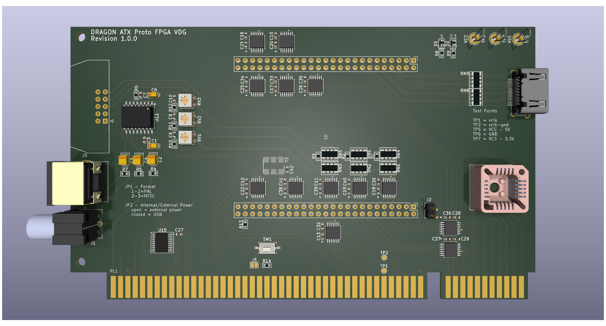

# Dragon ATX Prototype FPGA VDG

This repository contains the KiCad project files
to produce the VDG component board for my
ATX Prototype backplane.

This design requires the ATX backplane board in order 
to operate
See https://github.com/jimbro1000/DragonATXProto

## Notes

Revision 1 includes a more modern RGB fed modulator
design that removes a significant problem in the 
form of the old LM1889 modulator. The board also
provides the mounting points for the various mezzanine
boards that have been previously developed. If the
mezzanine option is to be used the rest of the card
should be left unpopulated

This design has been completed using KiCad 9. Earlier
versions of KiCad are not compatible

## Design

Unlike previous iterations that attempt to simply
replicate the original 6847 using CPLD hardware, this
design is aimed at a full upgrade and replacement for 
the 6847 and 6883. By combining the functionality of
the two chips are significant saving in complexity is
achieved. There is no longer a requirement to 
artificially synchronise the video against the CPU
clock cycle, this is inherent as the video clock is
tied directly to the cpu clock.

## SAM upgrades

The SAM replacement is based around the work done by
Ciaran Anscomb to upgrade the SAM to include RAM paging.
His design extended to 512KB which, while "adequate", 
is wasteful of the target FPGA device which includes
16MB of RAM. Of that 16MB only 2MB is directly accessed
as a single block. The 2MB is 16bit wide (technically 4MB)
but accessing both halves of the RAM adds extra complexity
to the read/write cycle, just using one half is definitely
simpler.

### Memory Paging ###

The upgraded SAM provides MMU capabilities, both paging and
process (page protection). With 256 8K pages in the address
space and each page can be allocated to RAM or ROM. Each 
process has its own page map.

Processes are either:
1. supervisor  
2. display
3. library (shared)
4. user process 1
5. user process 2
6. user process 3
7. user process 4
8. user process 5

The shared process and display are used purely for 
identification of shared pages.

#### Display process ####

The display process is used only for read operations
by the VDG side of the clock cycle. The same pages can
be shared with the supervisor or a user process.

### Blitter ###

The blitter provides out-of-process memory copy in one
of 5 operations

1. Full page copy (8K copy from one page to another)
2. Continuous block copy (within process address space)
3. Shaped to continuous (within process address space)
4. Continuous to shaped (within process address space)
5. Shaped to shaped (within process address space)

All operations are defined by an origin, destination and 
byte length (maximum is 8K)

Shaped operations have two further parameters - width
and gap. The width defines how many bytes in a row
are copied and the gap the number of bytes to skip to
the next run of bytes

Copying can only be performed between pages allocated
to the initiating process

Only a single blit operation can be performed at a time,
all operations can be queued

The blit operates at the highest clock speed achievable
by the RAM and SAM. Nominally this is 166MHz with a 3 cycle 
latency, the SAM operates at 28.6MHz and each byte copy
takes 3 cycles. Effectively this means a copy rate of
8 bytes per CPU clock cycle (using interleaved access
between CPU, VDG and Blitter) at regular 0.89MHz CPU
clock speeds. Running at a faster CPU speed would reduce
the available slots for blit operations

The number of cycles for the blitter will be adjusted
to suit the cpu and vdg clock speeds

A maximum copy speed can be achieved by halting the CPU
